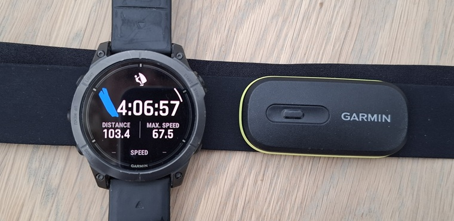
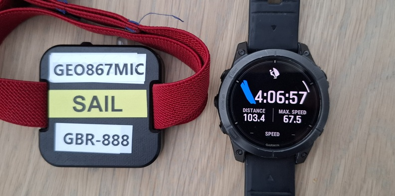
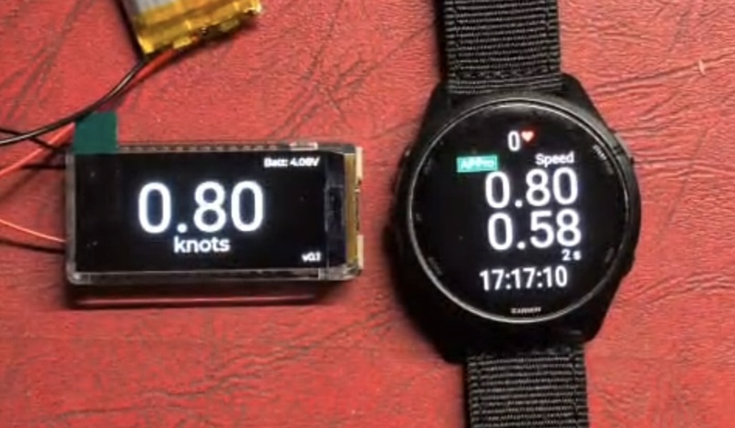

## Garmin + u-blox integration

### Introduction

This project describes the potential for integration of Garmin watches with u-blox GNSS receivers.

The concept might appear slightly crazy, but there are numerous benefits for the speed sailing community.

This page provides some background, opportunities, approach, and some of the benefits.

### Background

It is worth mentioning that after buying an expensive sports watch, serious runners and cyclists will often buy a heart rate monitor. The [HRM 600](https://www.garmin.com/en-GB/p/1473393/) is Garmin's premium heart rate monitor, retailing at around 150 GBP / 170 USD. Nevertheless, athletes of all levels will often pay for such a device, because it produces far more accurate readings than the HR sensor in their watch.

Speed sailors typically use a dedicated GPS logger such as the [Motion GPS](https://www.motion-gps.com/motion) to record speeds that are far more accurate than sports watches. GPS loggers such as the Mini Motion also record metrics that make it possible to validate the speed data, which is a capability lacking in sports watches. The Garmin acts is a convenient device for monitoring performance, but the Motion provides the most accurate results.

After each session, data must be downloaded from the Motion via Wi-Fi, prior to uploading to [GPS-Speedsurfing.com](https://www.gps-speedsurfing.com/), or [speedsurf.app](https://speedsurf.app/). This is quite tedious, especially when Garmin watches can automatically upload to those same sites, and the likes of [Waterspeed](https://www.waterspeedapp.com/) and [Strava](https://www.strava.com/). It would be neat if the Motion Mini (or similar) were to be paired with Garmin watches and benefit from automatic uploads via Garmin Connect.

### Opportunities

Since the Motion is no longer being developed it is not possible to pair it with a Garmin watch, but Scott Simms (developer of [APPro Windsurf](https://apps.garmin.com/en-US/apps/9567700b-6587-44be-9708-879bfc844791)) has been experimenting with [Bluetooth Low Energy](https://en.wikipedia.org/wiki/Bluetooth_Low_Energy) (BLE) connections between APPro and a [LILYGO T-Display S3 AMOLED](https://lilygo.cc/products/t-display-s3-amoled?variant=43506902368437) (H713). The LilyGo is based on the ESP32-S3R8 Dual-core LX7 microprocessor, and the two devices can happily communicate via BLE.

There are several possible applications for BLE, but one idea is to link ESP32-based devices that contain a u-blox GNSS receiver with Garmin watches, via an open protocol. Several preliminary investigations have been undertaken to assess the feasibility of this idea, and several benefits have been identified. These benefits are not limited to the watch and APPro, but also apply to the ESP32-based device itself.

### Benefits

APPro

- All speeds and results displayed by APPro can be based on accurate u-blox data from the ESP32.
- Top speeds calculated from 5 Hz data will be far more reliable, and not prone to jitter or [aliasing](https://logiqx.github.io/gps-details/general/aliasing/).
- Metrics such as sAcc and hAcc can be used for filtering, thus eliminating the majority of spikes.

Garmin

- 5 Hz u-blox data can be recorded in the FIT file, alongside the usual session data, heart rate, etc.
- 5 Hz u-blox data can be automatically uploaded to Garmin Connect, providing free storage.
- 5 Hz u-blox data can be automatically uploaded to GPS-Speedsurfing, Waterspeed, etc.

ESP32

- u-blox results can be displayed by APPro, especially useful for ESP32 devices without a screen.
- 5 Hz u-blox data can be automatically uploaded to Garmin Connect, providing free storage.
- 5 Hz u-blox data can be automatically uploaded to GPS-Speedsurfing, Waterspeed, etc.

Analysis

- FIT files containing 5 Hz u-blox data, plus the usual lat + lon + sog + cog from the built in GNSS.
- FIT files including 5 Hz u-blox accuracy estimates (e.g. sAcc and hAcc), plus satellite counts and HDOP.
- FIT files containing all of the usual session details, plus fitness data such as HR, etc.

### Feasibility

Some provisional investigations have already been undertaken.

- We have demonstrated that BLE communication is possible between APPro and an ESP32 device.
- We have confirmed the required u-blox data can be stored in Garmin FIT files; 5 Hz = 120 bytes / sec.

Some further investigations are required.

- Stability of Garmin timings so that u-blox data can be logged reliably. The current intention is to implement double-buffering.
- Reliability of BLE connection and reconnections throughout the whole session, during wipeouts, etc.

### Technical Details

The following pages discuss the technical details.

- [Protocol](protocol.md) - UBX payload, extensibility, etc.
- [ESP32](esp32.md) - sending UBX payloads to the Garmin
- [APPro](appro.md) - receiving UBX payloads and saving it in the FIT
- [Analysis](analysis.md) - FIT file parsing

### Suitable Devices

There are a number of ESP32 devices that would benefit from BLE pairing with Garmin watches.

- [ESP-GPS Logger](https://github.com/RP6conrad/ESP-GPS-Logger)
  - [LILYGO T5 V2.3.1](https://lilygo.cc/products/t5-v2-3-1?variant=42366871699637) - BN213 or B74
    - [ESP32](https://www.espressif.com/en/products/socs/esp32) with integrated 2.4 GHz, 802.11 b/g/n Wi-Fi and Bluetooth 5 (LE) connectivity
- [LISA GPS](http://lisawindsurfing.shop/products/lisa-watersports-gps)
  - Perhaps the [LILYGO T-Display S3 AMOLED](https://lilygo.cc/products/t-display-s3-amoled?variant=43506902368437) or something similar?
    - [ESP32-S3](https://www.espressif.com/en/products/socs/esp32-s3) with integrated 2.4 GHz, 802.11 b/g/n Wi-Fi and Bluetooth 5 (LE) connectivity
- ... other ESP32 projects in progress
  - Some with displays, and some without displays
  - ESP32 and ESP32-S3 microcontrollers have 802.11 b/g/n Wi-Fi and Bluetooth 5 (LE) connectivity
  - ESP32-S2 microcontrollers do <u>not</u> have integrated Bluetooth 5 (LE) connectivity
  

Some benefits for users of ESP32 devices with integrated BLE, even when they have a display:

- Live results can also be displayed by APPro, providing additional real-time feedback.
- 5 Hz u-blox data can be automatically uploaded to Garmin Connect, providing free storage.
- 5 Hz u-blox data can be automatically uploaded to GPS-Speedsurfing, Waterspeed, etc.

Automatic uploads to multiple platforms (courtesy of Garmin) is likely to make life much simpler for users.

Garmin watches supporting CIQ 3.1 upwards should be suitable, even $30 watches from eBay or Marketplace!

### Additional Thoughts

Since the data from the built-in GNSS receiver is also in the FIT file there may be further possibilities to verify results.

The FIT file essentially contains the 1 Hz Garmin data, and 5 Hz UBX data which can be considered to be independent.

It might also be desirable to send things such as HR data from the Garmin to the ESP32.

### Next Steps

Further activities to prove that this concept will work reliably.

- Ascertain the reliability of BLE connections
- Ascertain the stability of Garmin timings
- Define the BLE profile

