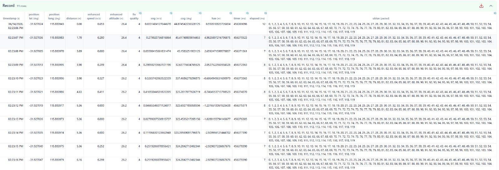

## Garmin + u-blox integration

### APPro

It is envisaged that the ESP32 will send UBX payloads either 5 or 10 times per second.

- 20 byte array, suitable for the hardcoded Garmin [MTU](https://github.com/Logiqx/garmin-ubx/discussions/2) size

It is envisaged that the ESP32 will also send summary payloads to APPro (or similar), once per second.

- 20 byte array, but containing one second averages where applicable

See the [protocol](protocol.md) page and [Google Sheet](https://docs.google.com/spreadsheets/d/1XAQbnhaoFV_E_tIXIC6ekw-PZZEP4lom5GkxAbc-hIk/edit?usp=sharing) for more details about the UBX payloads.

#### Notes

- The UBX payloads simply need to be concatenated and written to the FIT
  - 5 or 10 Hz data will be received in multiple payloads, each of 20 bytes
- Live data from the ESP32 should be used instead of values from the Garmin API
  - SOG and COG from the Garmin API should still be written to the FIT

#### FIT Limitations

FIT records have a limit of 256 bytes, but a UBX payload containing 5 Hz data is is only 100 bytes.

An earlier test confirmed that a 120 byte array can easily be stored in each FIT record.

10 Hz data would require a 200 byte array within each FIT record, which has a total limit of 256 bytes.

This should be ok, since existing FIT records do not occupy 56 bytes - perhaps 49 including APPro fields?

#### Nuances

Garmin watches write records to the FIT file once per second, but the timings of BLE events may vary slightly.

To ensure that all payloads are handled correctly (e.g. live results, and FIT writer), [double-buffering](https://en.wikipedia.org/wiki/Multiple_buffering) is proposed.

- UBX payloads are appended to buffer 1, whilst the timer event reads from buffer 2 (initially empty)
- UBX payloads are appended to buffer 2, whilst the timer event reads from buffer 1
- ... etc

The buffers might benefit from using [Application.Storage](https://developer.garmin.com/connect-iq/core-topics/persisting-data/) but other approaches may be possible.

Hopefully this simple approach will ensure that all UBX payloads are safely written to the FIT file.

